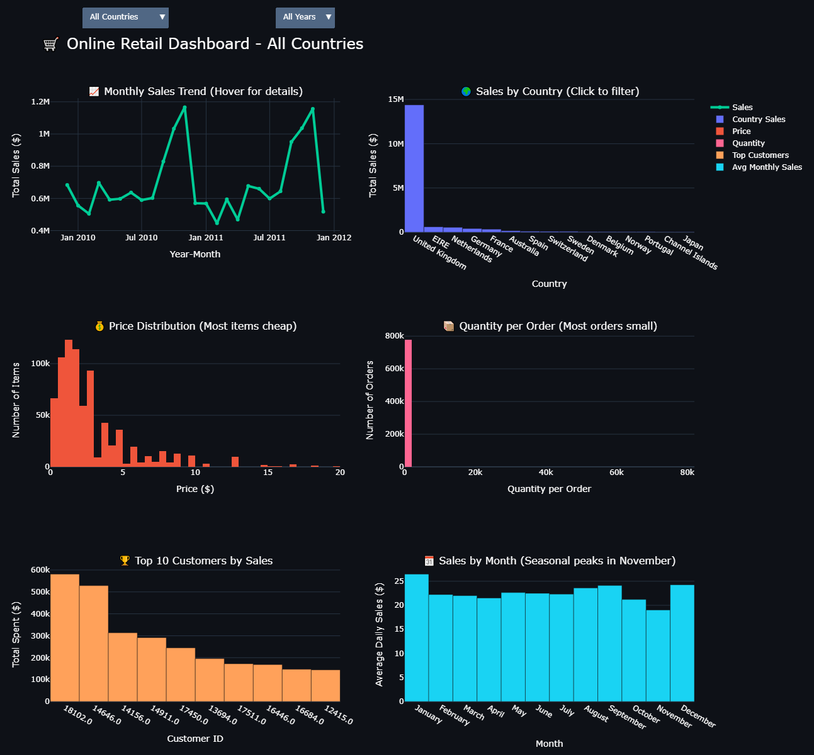

# 🛒 Online Retail Analytics & Interactive Dashboard Portfolio

## 🚀 Live Interactive Dashboards
**No setup needed — open in any browser for full interactivity!**

- [Super Interactive Dashboard](super_interactive_retail_dashboard.html) — Full dashboard with hover tooltips, zoom, and filters
- [Realistic Sales Forecast](realistic_sales_forecast.html) — Interactive forecast for next 12 months

## 📊 Key Visualizations

### Full Interactive Dashboard

### Sales Forecast with Capped Growth

### Customer Cohort Retention Heatmap

## 📈 Project Overview
End-to-end analysis of an online retail dataset (2009-2011, ~780k transactions):

- Data cleaning & preparation (handling cancellations, missing values)
- Exploratory Data Analysis (EDA)
- Customer Segmentation using RFM analysis
- Customer Retention with Cohort heatmap
- Time Series Forecasting using Prophet (with capped growth for realistic predictions)
- Fully interactive dashboards built with Plotly

**Key Business Insights**:
- UK accounts for ~90% of total sales
- Strong seasonal peak in November (holiday season)
- Most products priced under $5
- Most orders contain small quantities (1-10 items)
- Top customers drive significant revenue
- Forecast shows continued growth with realistic limits

## 📁 Repository Files
- `online-retail-analytics-portfolio.ipynb` — Complete code, cleaning, RFM, cohort, forecasting
- `super_interactive_retail_dashboard.html` — Main interactive dashboard (recommended)
- `realistic_sales_forecast.html` — Interactive sales forecast
- `online_retail_dashboard.png` — Dashboard screenshot
- `sales_forecast.png` — Forecast visualization
- `cohort_heatmap.png` — Customer retention heatmap

## 🛠️ Tech Stack
- Python (pandas, sqlite3)
- Forecasting: Prophet
- Visualization: Plotly (interactive), Matplotlib/Seaborn
- Database: SQLite (normalized schema)

## ⚡ How to Explore
1. Click any `.html` file for interactive experience (hover, zoom, explore)
2. View PNG images for quick visual insights
3. Run the notebook in Kaggle or Colab for full code details

Built for clarity — technical and non-technical users can discover insights easily.

---

**By Omneya Saeid**  
GitHub: [@Omneya21](https://github.com/Omneya21)

⭐ Star the repo if you found it useful!
