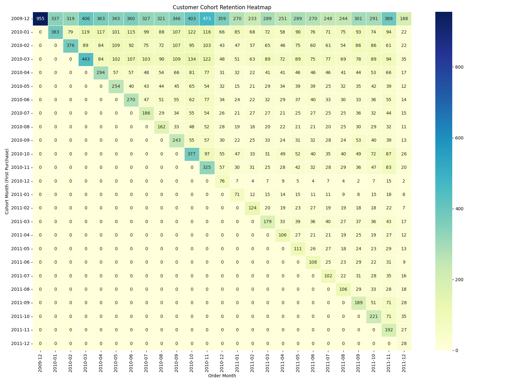

# 🛒 Online Retail Analytics & Interactive Dashboard Portfolio

## 🚀 Interactive Dashboards (Open in Browser)
**No setup needed — click to explore interactively!**

- [Super Interactive Dashboard](super_interactive_retail_dashboard.html) — Full dashboard with hover & zoom
- [Realistic Sales Forecast](realistic_sales_forecast.html) — Forecast for next 12 months

## 📊 Key Visualizations

### Full Interactive Dashboard

### Sales Forecast with Capped Growth

### Customer Cohort Retention Heatmap

## 📈 Project Overview
End-to-end analysis of an online retail dataset (2009-2011, ~780k transactions):

- Data cleaning & preparation
- Exploratory Data Analysis (EDA)
- Customer Segmentation with RFM
- Retention Analysis with Cohort
- Time Series Forecasting using Prophet (with capped growth for realism)
- Interactive dashboards with Plotly

**Key Insights**:
- UK dominates ~90% of sales
- Strong November peak (holiday season)
- Most products under $5
- Most orders small (1-10 items)
- Top customers drive major revenue
- Forecast shows continued growth with realistic limits

## 📁 Repository Files
- `online-retail-analytics-portfolio.ipynb` — Full code & analysis
- `super_interactive_retail_dashboard.html` — Main interactive dashboard
- `realistic_sales_forecast.html` — Interactive forecast
- `Online_Retail_Interactive_Dashboard.png` — Dashboard screenshot
- `Sales_Forecast_with_Capped_Growth.png` — Forecast visualization
- `cohort_heatmap.png` — Retention heatmap

## 🛠️ Tech Stack
- Python (pandas, sqlite3)
- Forecasting: Prophet
- Visualization: Plotly (interactive), Matplotlib/Seaborn
- Database: SQLite

## ⚡ How to Explore
1. Click HTML files for interactive experience
2. View PNG images for quick insights
3. Run the notebook in Kaggle/Colab for details

---

**By Omneya Saeid** | GitHub: [@Omneya21](https://github.com/Omneya21)

⭐ Star if useful!
